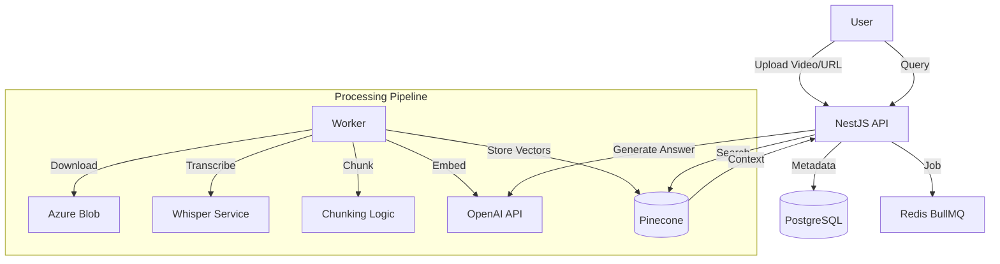

# AI Video Knowledge Extractor - System Documentation

## 1. Overview
A monolithic NestJS application that extracts knowledge from videos through automated transcription, semantic chunking, and AI-powered querying.

### Features
- **Video Processing**: Upload files or provide YouTube URLs.
- **Audio Extraction**: Automatic audio extraction via FFmpeg.
- **Transcription**: Hybrid support for OpenAI Whisper API or Local Whisper (via Docker).
- **Semantic Chunking**: Intelligent text segmentation.
- **Vector Embeddings**: managed via OpenAI embeddings.
- **AI Chat**: Context-aware Q&A using OpenAI GPT models.
- **Background Processing**: Reliable job queues with BullMQ and Redis.

---

## 2. Architecture

### Core Components
1.  **API Server (NestJS)**: Handles requests, business logic, and orchestrates the pipeline.
2.  **Worker (BullMQ)**: Processes background jobs (Download -> Transcribe -> Chunk -> Embed).
3.  **Database (PostgreSQL)**: Stores video metadata, transcript segments, and job status.
4.  **Vector Store (Pinecone)**: Stores semantic embeddings for fast retrieval.
5.  **Transcription Service (Python)**: Optional local service for zero-cost transcription.

### Data Flow


---

## 3. Setup & Installation

### Prerequisites
-   **Docker & Docker Compose** (Recommended)
-   **Node.js 18+** (For local dev)
-   **Services**: OpenAI API Key, Pinecone API Key, Azure Blob Storage Connection String.

### Environment Configuration
Create a `.env` file in the root directory:

```env
# Database
DATABASE_HOST=postgres
DATABASE_PORT=5432
DATABASE_USERNAME=postgres
DATABASE_PASSWORD=password
DATABASE_NAME=ai_video_extractor

# Redis
REDIS_HOST=redis
REDIS_PORT=6379

# Services
OPENAI_API_KEY=sk-...
PINECONE_API_KEY=pcsk_...
PINECONE_INDEX_NAME=video-embeddings
AZURE_STORAGE_CONNECTION_STRING=...
AZURE_STORAGE_CONTAINER_NAME=video-files

# App Config
PORT=3000
NODE_ENV=production

# Whisper Configuration
# Options: 'openai' (API) or 'local' (Self-hosted)
WHISPER_MODE=local
LOCAL_WHISPER_URL=http://whisper:5000
WHISPER_MODEL_SIZE=base
```

### Running with Docker (Production Ready)
The easiest way to run the entire stack:
```bash
docker compose up -d --build
```
This starts:
-   `app`: Main NestJS application (Port 3000)
-   `whisper`: Local Python Whisper server (Port 5000)
-   `postgres`: Database (Port 5432)
-   `redis`: Job Queue (Port 6379)

### Running Locally (Development)
1.  **Start Dependencies**:
    ```bash
    docker compose up -d postgres redis whisper
    ```
2.  **Install dependencies**:
    ```bash
    npm install
    ```
3.  **Run App**:
    ```bash
    # Ensure .env points to localhost for DB/Redis if running app outside docker
    npm run start:dev
    ```

---

## 4. API Reference

### Health Check
`GET /api/health`
Checks connectivity to DB, Redis, and configured services.

### Video Operations
-   **Upload**: `POST /api/video/upload`
    -   Body (Multipart): `file` (Video file)
    -   Body (JSON): `youtube_url` (String)
-   **Status**: `GET /api/video/status/:id`
    -   Returns processing stage (downloading, transcribing, embedding, ready).
-   **Transcript**: `GET /api/video/transcript/:id`

### Querying
-   **Chat**: `POST /api/query`
    ```json
    {
      "query": "What are the key takeaways?",
      "video_id": "uuid-..."
    }
    ```

---

## 5. Troubleshooting

-   **Database/Redis Connection Refused**:
    -   If running app locally but DB in docker, ensure ports are exposed (mapped in `docker-compose.yml`).
    -   Check `.env`: `DATABASE_HOST` should be `localhost` (if local) or `postgres` (if in docker network).

-   **Whisper Errors**:
    -   Verify `WHISPER_MODE`.
    -   If `local`, ensure the `whisper` container is healthy (`docker compose ps`).
    -   First run of local whisper downloads the model (~1GB for 'base'), which may take time.

-   **Build Failures**:
    -   Ensure `npm run build` passes locally.
    -   Check memory allocation for Docker (building NestJS apps can be memory intensive).
